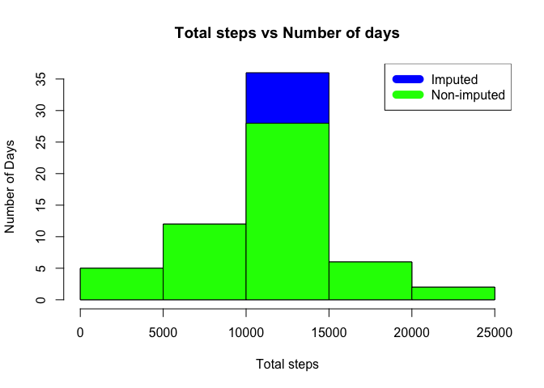

Reproducible research - Week 2 coursework
================

Loading and preprocessing the data
----------------------------------

``` r
temp <- tempfile()
download.file("http://d396qusza40orc.cloudfront.net/repdata%2Fdata%2Factivity.zip",temp)
unzip(temp)
unlink(temp)
activity <- read.csv("activity.csv")
activity_bkp<-activity
head(activity)
```

    ##   steps       date interval
    ## 1    NA 2012-10-01        0
    ## 2    NA 2012-10-01        5
    ## 3    NA 2012-10-01       10
    ## 4    NA 2012-10-01       15
    ## 5    NA 2012-10-01       20
    ## 6    NA 2012-10-01       25

###### Remove incomplete cases

``` r
activity_clean <- activity[complete.cases(activity),]
head(activity_clean)
```

    ##     steps       date interval
    ## 289     0 2012-10-02        0
    ## 290     0 2012-10-02        5
    ## 291     0 2012-10-02       10
    ## 292     0 2012-10-02       15
    ## 293     0 2012-10-02       20
    ## 294     0 2012-10-02       25

###### Summary -- group steps by dates, library dplyr is used

``` r
activity_summary_dates <- aggregate(steps~date,data=activity_clean,sum )

names(activity_summary_dates)<- c("dates","total_steps")
head(activity_summary_dates)
```

    ##        dates total_steps
    ## 1 2012-10-02         126
    ## 2 2012-10-03       11352
    ## 3 2012-10-04       12116
    ## 4 2012-10-05       13294
    ## 5 2012-10-06       15420
    ## 6 2012-10-07       11015

###### Histogram total steps vs day

``` r
hist(activity_summary_dates$total_steps, xlab = "Total steps", col="green",ylab = "Days", main = "Total steps vs Days" )
```

<!-- -->

###### Mean and median for group by dates data

``` r
mean_steps <- mean(activity_summary_dates$total_steps)

median_steps <- median(activity_summary_dates$total_steps)

mean_steps
```

    ## [1] 10766.19

``` r
median_steps
```

    ## [1] 10765

##### Calculate mean and median for data grouped by interval and get the interval which has the max mean

``` r
activity_summary_interval<-aggregate(steps~interval,data=activity_clean,mean)

names(activity_summary_interval)<- c("intervals","mean")

head(arrange(activity_summary_interval, desc(mean)),1)
```

    ##   intervals     mean
    ## 1       835 206.1698

##### Draw the plot, interval vs means of intervals

``` r
with(activity_summary_interval, {plot(intervals, mean, type="l",col=3,main ="Interval and means of intervals")})
ab <-abline(lm(activity_summary_interval$mean ~ activity_summary_interval$intervals))
```

<!-- -->

##### Total rows with NA values

``` r
total_na<-sum(complete.cases(activity)==FALSE)
total_na
```

    ## [1] 2304

##### Replace incomplete cases

N/A replaces with mean value for steps

``` r
activity$steps[is.na(activity$steps)] = mean(activity$steps, na.rm=TRUE)
head(activity,10)
```

    ##      steps       date interval
    ## 1  37.3826 2012-10-01        0
    ## 2  37.3826 2012-10-01        5
    ## 3  37.3826 2012-10-01       10
    ## 4  37.3826 2012-10-01       15
    ## 5  37.3826 2012-10-01       20
    ## 6  37.3826 2012-10-01       25
    ## 7  37.3826 2012-10-01       30
    ## 8  37.3826 2012-10-01       35
    ## 9  37.3826 2012-10-01       40
    ## 10 37.3826 2012-10-01       45

##### Total steps, group by date, after replacing missing values

``` r
activity_summary_dates_full <-  aggregate(steps~date,data=activity,sum )
names(activity_summary_dates_full)<-c("date","total_steps")
```

##### Histogram after completing missing values

``` r
hist(activity_summary_dates_full$total, xlab = "Total steps", ylab = "Number of Days", main = "Total steps vs Number of days",col="blue")

hist(activity_summary_dates$total_steps, xlab = "Total steps", col="green",ylab = "Days", main = "Total steps vs Days", add=T)

legend("topright", c("Imputed", "Non-imputed"), col=c("blue", "green"), lwd=10)
```

<!-- -->

###### Mean and median for group by dates data after imputation

``` r
new_mean <- mean(activity_summary_dates_full$total_steps)

new_median <- median(activity_summary_dates_full$total_steps)

new_mean
```

    ## [1] 10766.19

``` r
new_median
```

    ## [1] 10766.19

##### Difference between the original mean, median and the values after impulation

``` r
diff_mean<-new_mean -mean_steps

diff_mean
```

    ## [1] 0

``` r
diff_median<-new_median -median_steps

diff_median
```

    ## [1] 1.188679

``` r
total_diff <- sum(activity$steps) - sum(activity_clean$steps)

total_diff
```

    ## [1] 86129.51

##### New Factor variable -Day

``` r
weekdays <- c("Monday", "Tuesday", "Wednesday", "Thursday", "Friday")

activity$day = as.factor(ifelse(is.element(weekdays(as.Date(activity$date)),weekdays), "Weekday", "Weekend"))

table(activity$day)
```

    ## 
    ## Weekday Weekend 
    ##   12960    4608

##### Calculate mean data grouped by interval for imputed data

``` r
steps_by_interval <- aggregate(steps ~ interval + day, activity, mean)
```

##### Plot mean vs intervals by Weekday and Weekend

``` r
library(lattice)

xyplot(steps_by_interval$steps ~ steps_by_interval$interval|steps_by_interval$day, main="Average Steps per Day by Interval",xlab="Interval", ylab="Steps",layout=c(1,2), type="l")
```

<!-- -->
